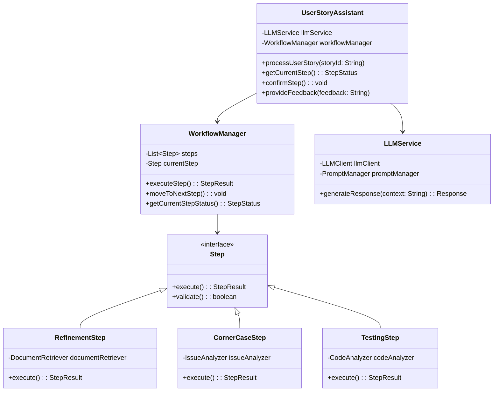

## Índice

0. [Ficha del proyecto](#0-ficha-del-proyecto)
1. [Descripción general del producto](#1-descripción-general-del-producto)
2. [Instalación y Configuración](#2-instalación-y-configuración)
3. [Arquitectura del sistema](#3-arquitectura-del-sistema)
   - [3.1. Diagrama de arquitectura](#31-diagrama-de-arquitectura)
   - [3.2. Descripción de componentes principales](#32-descripción-de-componentes-principales)
   - [3.3. Descripción de alto nivel del proyecto y estructura de ficheros](#33-descripción-de-alto-nivel-del-proyecto-y-estructura-de-ficheros)
4. [Tests y CI/CD](#4-tests-y-cicd)
   - [4.1. Estado de los Tests](#41-estado-de-los-tests)
   - [4.2. Requisitos de Calidad](#42-requisitos-de-calidad)
   - [4.3. Proceso de Pull Request](#43-proceso-de-pull-request)
5. [Modelo de datos](#5-modelo-de-datos)
6. [Historias de usuario](#6-historias-de-usuario)
7. [Tickets de trabajo](#7-tickets-de-trabajo)
8. [Pull Requests](#8-pull-requests)
9. [Roadmap](#9-roadmap)

---

## 0. Ficha del proyecto

### **0.1. Autor:**

rgarciademarina

### **0.2. Nombre del proyecto:**

Refinador de Historias de Usuario

### **0.3. Descripción breve del proyecto:**

Un asistente que usará un LLM para ayudar con el proceso de refinamiento de historias de usuario de un equipo de desarrollo.

### **0.4. URL del proyecto:**

[https://github.com/rgarciademarina/AI4Devs-finalproject-RGM](https://github.com/rgarciademarina/AI4Devs-finalproject-RGM)

---

## 1. Descripción general del producto

> Describe en detalle los siguientes aspectos del producto:

El Asistente de Refinamiento de Historias de Usuario es una herramienta basada en IA que asiste a los equipos de desarrollo en la mejora de sus historias de usuario a través de un proceso guiado de tres pasos. Utiliza un modelo LLM (Llama 3.2:11b) para proporcionar recomendaciones contextualizadas basadas en el historial del proyecto.

### **1.1. Visión General**

El asistente facilita la creación y refinamiento de historias de usuario, asegurando claridad, completitud y calidad en la documentación. A través de su integración con Jira local, permite una gestión eficiente y sincronizada de las historias, detectando casos esquina y sugiriendo estrategias de testing adecuadas.

### **1.2. Objetivo del Producto**

Mejorar la calidad y completitud de las historias de usuario mediante:

- Refinamiento de definiciones y criterios de aceptación
- Identificación proactiva de casos esquina
- Recomendaciones comprensivas de estrategias de testing

### **1.3. Diseño y experiencia de usuario**

Proporciona imágenes y/o videotutorial mostrando la experiencia del usuario desde que aterriza en la aplicación, pasando por todas las funcionalidades principales.

**TBD**

---

## 2. Instalación y Configuración

Para instrucciones detalladas de instalación y configuración, por favor consulte:

- [Instrucciones del Backend](./backend/README.md)
- [Instrucciones del Frontend](./frontend/README.md)

---

## 3. Arquitectura del sistema

### **3.1. Diagrama de arquitectura**

Usa el formato que consideres más adecuado para representar los componentes principales de la aplicación y las tecnologías utilizadas. Explica si sigue algún patrón predefinido, justifica por qué se ha elegido esta arquitectura, y destaca los beneficios principales que aportan al proyecto y justifican su uso, así como sacrificios o déficits que implica.



### **3.2. Descripción de componentes principales**

En esta sección se describen los componentes más importantes del sistema, incluyendo la tecnología utilizada.

#### **LLM Service**

- **Tecnología principal**: Llama 3.2:11b
- **Framework**: LangChain
- **Propósito**: Gestionar la interacción con el modelo de lenguaje para el análisis y generación de sugerencias.
- **Características clave**:
  - Gestión de prompts
  - Control de contexto
  - Manejo de tokens
  - Procesamiento de respuestas

#### **API Service**

- **Framework**: FastAPI
- **Base de datos**: PostgreSQL
- **Propósito**: Proporcionar la interfaz REST para la aplicación.
- **Características clave**:
  - Autenticación y autorización
  - Validación de datos
  - Documentación automática
  - Gestión de sesiones

#### **Conectores**

- **Integraciones**: Jira, GitHub
- **Propósito**: Integración con sistemas existentes para sincronización de datos.
- **Características clave**:
  - Sincronización de historias de usuario
  - Actualización de estados
  - Gestión de webhooks

#### **Frontend**

- **Framework**: Vue.js o React (dependiendo de la elección)
- **Propósito**: Proporcionar una interfaz de usuario interactiva.
- **Características clave**:
  - Interfaz intuitiva
  - Visualización de resultados
  - Feedback en tiempo real

### **3.3. Descripción de alto nivel del proyecto y estructura de ficheros**

El proyecto está organizado en dos componentes principales:

```
user-story-assistant/
├── backend/           # Servidor backend en Python
│   ├── src/          # Código fuente del backend
│   │   ├── api/      # Endpoints y rutas de la API
│   │   ├── config/   # Configuraciones
│   │   ├── core/     # Lógica de negocio principal
│   │   ├── llm/      # Servicios de LLM
│   │   ├── models/   # Modelos de datos
│   │   └── utils/    # Utilidades
│   ├── tests/        # Tests del backend
│   └── README.md     # Documentación del backend
│
├── frontend/         # Cliente frontend en Vue.js
│   ├── src/         # Código fuente del frontend
│   ├── tests/       # Tests del frontend
│   └── README.md    # Documentación del frontend
│
├── docs/            # Documentación general
└── README.md        # Este archivo
```

Esta estructura separa claramente las responsabilidades entre el backend y el frontend, facilitando:
- Desarrollo independiente de cada componente
- Despliegues separados
- Gestión independiente de dependencias
- Equipos trabajando en paralelo

---

## 4. Tests y CI/CD

### **4.1. Estado de los Tests**

- **Tests Unitarios**: Cubren la lógica de negocio y componentes individuales.
- **Tests de Integración**: Verifican la interacción entre componentes y servicios.
- **Tests End-to-End**: Simulan el flujo de usuario completo.

### **4.2. Requisitos de Calidad**

- **Cobertura de Código**: 80% como mínimo.
- **Complejidad Ciclomática**: Menos de 10.

### **4.3. Proceso de Pull Request**

1. **Crear una Rama**: Desde `main`, crea una rama con el nombre del feature o fix.
2. **Desarrollar y Probar**: Implementa el cambio y ejecuta los tests locales.
3. **Crear Pull Request**: En GitHub, crea un PR desde tu rama hacia `main`.
4. **Revisión de Código**: Otro miembro del equipo revisa el código y aprueba.
5. **Merge**: Una vez aprobado, se mergea el PR hacia `main`.

---

## 5. Modelo de datos

> Describe el modelo de datos utilizado en el sistema, incluyendo entidades principales, relaciones y cualquier esquema relevante.

**TBD**

## 6. Historias de usuario

### **Prioridad 1 (Crítica):**
- US-001: Crear Historia de Usuario
- US-002: Crear Proyecto
- US-004: Importar Historia desde Jira
- US-006: Iniciar Refinamiento
- US-007: Ejecutar Paso de Refinamiento

**Prioridad 2 (Importante):**
- US-003: Configurar Integraciones
- US-008: Revisar Casos Esquina
- US-010: Actualizar Historia en Jira

**Prioridad 3 (Deseable):**
- US-005: Crear Historia Manual
- US-009: Generar Recomendaciones de Testing

### **5.8. Ejemplo de Criterios de Aceptación Detallados**

Para US-007: Ejecutar Paso de Refinamiento

**Criterios de Aceptación:**
- LLM respondiendo correctamente
- Prompts funcionando según esperado
- Cache implementado
- Tests de integración pasando

## 7. Tickets de trabajo

> Lista y describe los tickets de trabajo necesarios para el desarrollo del proyecto.

### **6.5. API Core**

#### TECH-008: Endpoints de Proyectos
**Tipo:** Tarea Técnica  
**Prioridad:** Alta  
**Estimación:** 3 puntos  
**Dependencias:** TECH-002, TECH-003

**Descripción:**
- Implementar CRUD de proyectos
- Crear validaciones
- Implementar filtros y búsqueda
- Añadir paginación

#### TECH-009: Endpoints de Historias
**Tipo:** Tarea Técnica  
**Prioridad:** Alta  
**Estimación:** 5 puntos  
**Dependencias:** TECH-004, TECH-008

**Descripción:**
- Implementar CRUD de historias
- Crear sincronización con Jira
- Implementar validaciones
- Añadir búsqueda y filtros

### **6.6. Proceso de Refinamiento**

#### TECH-010: Motor de Refinamiento
**Tipo:** Tarea Técnica  
**Prioridad:** Alta  
**Estimación:** 13 puntos  
**Dependencias:** TECH-007, TECH-009

**Descripción:**
- Implementar máquina de estados
- Crear pipeline de procesamiento
- Implementar análisis de completitud
- Crear detector de casos esquina
- Implementar generador de tests

**Criterios de Aceptación:**
- Pipeline completo funcionando
- Casos esquina detectados correctamente
- Sugerencias de test generadas
- Tests de integración pasando

#### TECH-011: Setup Frontend
**Tipo:** Tarea Técnica  
**Prioridad:** Media  
**Estimación:** 5 puntos  
**Dependencias:** TECH-003

**Descripción:**
- Configurar entorno de desarrollo frontend
- Integrar con backend
- Implementar autenticación de usuarios
- Desarrollar componentes básicos de la interfaz

## 8. Pull Requests

> Documenta 3 de las Pull Requests realizadas durante la ejecución del proyecto

**Pull Request 1**

- **Título:** Implementación del servicio LLM
- **Descripción:** Añade el servicio LLM utilizando LangChain y configura las integraciones necesarias.
- **Cambios Principales:**
  - Añadidos archivos en `src/llm/`
  - Configuración de prompts en `src/llm/prompts/`
  - Tests unitarios para el servicio LLM
- **Estado:** Integrado

**Pull Request 2**

- **Título:** Desarrollo de la Interfaz Gráfica con Vue
- **Descripción:** Crea la interfaz gráfica básica utilizando LangFlow para la interacción con el asistente de refinamiento.
- **Cambios Principales:**
  - Añadidos archivos en `/frontend`
  - Configuración de Vue en `/6frontend`
  - Documentación de uso de la interfaz gráfica
- **Estado:** Integrado

**Pull Request 3**

- **Título:** Integración con Jira Local
- **Descripción:** Implementa el conector para Jira local usando la biblioteca `atlassian-python-api`.
- **Cambios Principales:**
  - Añadidos archivos en `src/integrations/jira/`
  - Configuración de clientes Jira en `src/integrations/jira/client.py`
  - Tests de integración para el conector Jira
- **Estado:** Integrado

## 9. Roadmap

El siguiente roadmap describe las funcionalidades planificadas para futuras versiones del asistente.

### **9.1. Q1 2025**

#### Mejoras Base
- Optimización de prompts y respuestas
- Mejora de la interfaz actual
- Documentación completa
- Corrección de bugs reportados

#### Testing y Calidad
- Tests end-to-end con Selenium y Cucumber (BDD)
- Tests de rendimiento con k6
- Monitorización de tiempos de respuesta

#### Autenticación y Persistencia
- Sistema de login con múltiples proveedores
- Persistencia de sesiones
- Gestión de perfiles de usuario
- Control de acceso basado en roles

#### Internacionalización
- Soporte de idiomas (español e inglés)
- Traducción de interfaces
- Gestión de recursos i18n
- Detección automática de idioma

### **9.2. Q2-Q3 2025**

#### Integración y Conectividad
- Sistema RAG para contexto de proyecto desde Jira
- Integración con Confluence para documentación
- Conexión con GitHub para seguimiento de código
- API pública para integraciones personalizadas

#### Personalización
- Configuración flexible de pasos de refinamiento
- Selección de formatos (Gherkin, Given-When-Then, etc.)
- Templates personalizables por equipo
- Configuración de reglas de validación

### **9.3. Q4 2025 - Q1 2026**

#### Análisis y Mejora Continua
- Sistema de feedback para el LLM
- Métricas de calidad de historias
- Dashboard de analytics
- Detección de patrones problemáticos

#### Colaboración en Tiempo Real
- Sesiones multiusuario
- Comentarios y anotaciones
- Sistema de votación
- Historial de cambios con diff

#### Automatización Avanzada
- Generación de diagramas técnicos
- Estimación automática
- Análisis de dependencias
- Detección de duplicados

### **9.4. 2026**

#### Integración con Desarrollo
- Generación de código base
- Sugerencia de tests
- Vinculación con PRs
- Análisis de impacto

#### Gestión del Conocimiento
- Base de conocimiento auto-mantenida
- Captura de decisiones técnicas
- Vinculación con documentación
- Templates evolutivos

#### Calidad y Cumplimiento
- Verificación de compliance
- Chequeo de seguridad
- Validación contra estándares
- Sistema de alertas

#### Experiencia de Usuario
- Interfaz adaptativa según rol/experiencia
- Atajos de teclado personalizables
- Temas visuales y accesibilidad

### **9.5. Priorización y Feedback**

Las prioridades del roadmap se ajustarán según:
- Feedback de usuarios
- Necesidades del mercado
- Viabilidad técnica
- Valor añadido al producto

Para sugerir nuevas funcionalidades o prioridades, por favor:
1. Abre un issue con la etiqueta "feature-request"
2. Describe el caso de uso y beneficios
3. Proporciona ejemplos si es posible