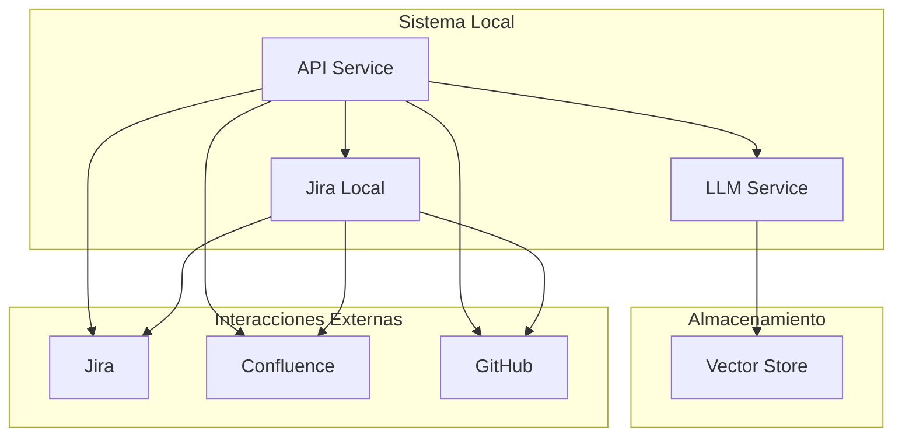

## Índice

0. [Ficha del proyecto](#0-ficha-del-proyecto)
1. [Descripción general del producto](#1-descripción-general-del-producto)
2. [Configuración del proyecto](#2-configuración-del-proyecto)
3. [Arquitectura del sistema](#3-arquitectura-del-sistema)
   - [3.1. Diagrama de arquitectura](#31-diagrama-de-arquitectura)
   - [3.2. Descripción de componentes principales](#32-descripción-de-componentes-principales)
   - [3.3. Descripción de alto nivel del proyecto y estructura de ficheros](#33-descripción-de-alto-nivel-del-proyecto-y-estructura-de-ficheros)
4. [Modelo de datos](#4-modelo-de-datos)
5. [Especificación de la API](#5-especificación-de-la-api)
6. [Historias de usuario](#6-historias-de-usuario)
7. [Tickets de trabajo](#7-tickets-de-trabajo)
8. [Pull requests](#8-pull-requests)

---

## 0. Ficha del proyecto

### **0.1. Tu nombre completo:**

Raúl García de Marina Maroto

### **0.2. Nombre del proyecto:**

Refinador de Historias de Usuario

### **0.3. Descripción breve del proyecto:**

Un asistente que usará un LLM para ayudar con el proceso de refinamiento de historias de usuario de un equipo de desarrollo.

### **0.4. URL del proyecto:**

[https://github.com/rgarciademarina/AI4Devs-finalproject-RGM](https://github.com/rgarciademarina/AI4Devs-finalproject-RGM)

---

## 1. Descripción general del producto

> Describe en detalle los siguientes aspectos del producto:

El Asistente de Refinamiento de Historias de Usuario es una herramienta basada en IA que asiste a los equipos de desarrollo en la mejora de sus historias de usuario a través de un proceso guiado de tres pasos. Utiliza un modelo LLM (Llama 3.2:11b) para proporcionar recomendaciones contextualizadas basadas en el historial del proyecto.

### **1.1. Visión General**

El asistente facilita la creación y refinamiento de historias de usuario, asegurando claridad, completitud y calidad en la documentación. A través de su integración con Jira local, permite una gestión eficiente y sincronizada de las historias, detectando casos esquina y sugiriendo estrategias de testing adecuadas.

### **1.2. Objetivo del Producto**

Mejorar la calidad y completitud de las historias de usuario mediante:

- Refinamiento de definiciones y criterios de aceptación
- Identificación proactiva de casos esquina
- Recomendaciones comprensivas de estrategias de testing

### **1.3. Diseño y experiencia de usuario**

Proporciona imágenes y/o videotutorial mostrando la experiencia del usuario desde que aterriza en la aplicación, pasando por todas las funcionalidades principales.

**TBD**

---

## 2. Configuración del proyecto

### **2.1. Instrucciones de instalación**

Documenta de manera precisa las instrucciones para instalar y poner en marcha el proyecto en local (librerías, backend, frontend, servidor, base de datos, migraciones y semillas de datos, etc.)

1. **Clonar el Repositorio**

   ```bash
   git clone https://github.com/rgarciademarina/AI4Devs-finalproject-RGM.git
   cd AI4Devs-finalproject-RGM
   ```

2. **Instalar Dependencias**

   ```bash
   poetry install
   ```

3. **Configurar Variables de Entorno**

   Crea un archivo `.env` basado en `.env.example` y completa las variables necesarias.

4. **Ejecutar los Tests**

   ```bash
   poetry run pytest --log-cli-level=DEBUG
   ```

5. **Iniciar la Aplicación**

   ```bash
   python src/llm/run_model.py --model llama-3.2-11b
   ```

---

## 3. Arquitectura del sistema

### **3.1. Diagrama de arquitectura**

Usa el formato que consideres más adecuado para representar los componentes principales de la aplicación y las tecnologías utilizadas. Explica si sigue algún patrón predefinido, justifica por qué se ha elegido esta arquitectura, y destaca los beneficios principales que aportan al proyecto y justifican su uso, así como sacrificios o déficits que implica.


### **3.2. Descripción de componentes principales**

En esta sección se describen los componentes más importantes del sistema, incluyendo la tecnología utilizada.

#### **LLM Service**

- **Tecnología principal**: Llama 3.2:11b
- **Framework**: LangChain
- **Propósito**: Gestionar la interacción con el modelo de lenguaje para el análisis y generación de sugerencias.
- **Características clave**:
  - Gestión de prompts
  - Control de contexto
  - Manejo de tokens
  - Procesamiento de respuestas

#### **API Service**

- **Framework**: FastAPI
- **Base de datos**: PostgreSQL
- **Propósito**: Proporcionar la interfaz REST para la aplicación.
- **Características clave**:
  - Autenticación y autorización
  - Validación de datos
  - Documentación automática
  - Gestión de sesiones

#### **Conectores**

- **Integraciones**: Jira, GitHub
- **Propósito**: Integración con sistemas existentes para sincronización de datos.
- **Características clave**:
  - Sincronización de historias de usuario
  - Actualización de estados
  - Gestión de webhooks

#### **Frontend**

- **Framework**: Vue.js o React (dependiendo de la elección)
- **Propósito**: Proporcionar una interfaz de usuario interactiva.
- **Características clave**:
  - Interfaz intuitiva
  - Visualización de resultados
  - Feedback en tiempo real

### **3.3. Descripción de alto nivel del proyecto y estructura de ficheros**

El proyecto sigue una arquitectura hexagonal (también conocida como puertos y adaptadores) para mantener el dominio de negocio aislado de las dependencias externas. La estructura de ficheros refleja esta separación de responsabilidades:

```plaintext
story-refinement-assistant/
├── .env.example                  # Template para variables de entorno
├── .gitignore
├── README.md
├── pyproject.toml                # Configuración de Poetry
├── docs/
│   ├── api/                      # Documentación de la API
│   ├── guides/                   # Guías de usuario
│   └── technical/                # Documentación técnica
├── scripts/
│   ├── setup.sh                  # Scripts de configuración
│   └── test.sh                   # Scripts de testing
├── src/
│   ├── __init__.py
│   ├── main.py                   # Punto de entrada de FastAPI
│   ├── config/
│   │   ├── __init__.py
│   │   └── settings.py           # Configuración de la aplicación
│   ├── api/
│   │   ├── __init__.py
│   │   ├── routes/
│   │   │   ├── __init__.py
│   │   │   ├── user_story.py      # Endpoints relacionados con historias de usuario
│   │   │   └── workflow.py       # Endpoints de workflow
│   ├── llm/
│   │   ├── __init__.py
│   │   ├── service.py             # Servicio de LLM
│   │   ├── config.py              # Configuración del LLM
│   │   ├── prompts/
│   │   │   ├── __init__.py
│   │   │   ├── refinement.py      # Plantillas de prompts para refinamiento
│   │   │   ├── corner_case.py     # Plantillas de prompts para casos esquina
│   │   │   └── testing.py         # Plantillas de prompts para testing
│   ├── workflows/
│   │   ├── __init__.py
│   │   └── manager.py             # Manager de flujo de trabajo
│   └── tests/
│       ├── __init__.py
│       ├── unit/
│       │   ├── __init__.py
│       │   └── test_service.py     # Tests unitarios para el servicio LLM
│       └── integration/
│           ├── __init__.py
│           └── test_endpoints.py   # Tests de integración para endpoints
├── tests/
│   ├── unit/
│   │   ├── __init__.py
│   │   └── test_service.py
│   └── test_main.py
└── frontend/
    ├── package.json
    ├── src/
    │   ├── App.vue
    │   ├── components/
    │   └── views/
    └── public/
```

---

## 4. Modelo de datos

> Describe el modelo de datos utilizado en el sistema, incluyendo entidades principales, relaciones y cualquier esquema relevante.

**TBD**

#### Patrones y Principios:

1. **Arquitectura Hexagonal**: Separa el dominio de la infraestructura para mantener una alta cohesión y bajo acoplamiento.
2. **Dependency Injection**: Facilita el testing y la modularidad, permitiendo sustituir dependencias fácilmente.
3. **Repository Pattern**: Abstrae el acceso a datos, permitiendo cambiar la fuente de datos sin afectar al dominio.
4. **Factory Pattern**: Facilita la creación de objetos complejos de manera controlada.
5. **Strategy Pattern**: Implementación de diferentes estrategias de procesamiento para flexibilidad y extensibilidad.

### **2.4. Infraestructura y despliegue**

Detalla la infraestructura del proyecto, incluyendo un diagrama en el formato que creas conveniente, y explica el proceso de despliegue que se sigue.

#### 2.4.1. Diagrama de Infraestructura



#### 2.4.2. Proceso de Despliegue

Como esta es una Prueba de Concepto (POC) enfocada en el entorno local, el proceso de despliegue se simplifica y no incluye contenedorización ni despliegues en la nube.

##### Fases del Despliegue

1. **Fase de Construcción**
   - Validación de código y tests unitarios
   - Instalación de dependencias
   ```bash
   # Clonar el repositorio
   git clone https://github.com/rgarciademarina/AI4Devs-finalproject-RGM.git
   cd AI4Devs-finalproject-RGM

   # Configurar el entorno virtual
   poetry install
   poetry shell

   # Ejecutar tests unitarios
   poetry run pytest tests/unit
   ```

2. **Fase de Integración con Jira Local**
   - Configuración e integración con Jira local
   - Validación de conexiones y sincronización básica
   ```bash
   # Configurar Jira Local
   # Seguir las instrucciones en el README para configurar Jira Server
   ```

3. **Fase de Ejecución del Modelo LLM**
   - Ejecutar el modelo LLM localmente
   ```bash
   # Asumiendo que tienes los pesos del modelo descargados
   python src/llm/run_model.py --model llama-3.2-11b
   ```

4. **Fase de Desarrollo de la Interfaz Gráfica**
   - Desarrollar y ejecutar la interfaz gráfica con LangFlow
   ```bash
   langflow run src/ui/app.py
   ```

#### 2.4.3. Configuración por Entorno

| Variable        | Desarrollo | Staging | Producción |
|-----------------|------------|---------|------------|
| `ENVIRONMENT`   | development| staging | production |
| `LOG_LEVEL`     | DEBUG      | INFO    | WARNING    |
| `DB_POOL_SIZE`  | 5          | 10      | 20         |
| `CACHE_TTL`     | 300        | 600     | 1800       |

#### 2.4.4. Monitorización del Despliegue

- **Métricas Clave**
  - Tiempo de respuesta de API
  - Uso de recursos (CPU/Memoria)
  - Tasa de errores
  - Latencia de servicios externos

- **Alertas Configuradas**
  - Errores en despliegue
  - Fallos en health checks
  - Degradación de performance
  - Errores de integración

#### 2.4.5. Rollback

En caso de detectar problemas durante el despliegue:

1. **Activación Automática**
   - Umbral de errores superado
   - Fallos en health checks
   - Timeouts excesivos

2. **Proceso de Rollback**
   ```bash
   # Revertir a versión anterior
   git checkout <commit_id>

   # Verificar estado
   git status
   ```

#### 2.4.6. Consideraciones de Seguridad

- Rotación automática de secretos
- Escaneo de vulnerabilidades en el código
- Validación de firmas de archivos importantes
- Logs de auditoría de despliegues

## 3. Modelo de datos

> Describe el modelo de datos utilizado en el sistema, incluyendo entidades principales, relaciones y cualquier esquema relevante.

TBD

## 4. Especificación de la API

> Detalla los endpoints de la API, métodos soportados, parámetros, respuestas y posibles códigos de estado.

*(Contenido omitido)*

- US-002: Crear Proyecto
- US-004: Importar Historia desde Jira
- US-006: Iniciar Refinamiento
- US-007: Ejecutar Paso de Refinamiento

**Prioridad 2 (Importante):**
- US-003: Configurar Integraciones
- US-008: Revisar Casos Esquina
- US-010: Actualizar Historia en Jira

**Prioridad 3 (Deseable):**
- US-005: Crear Historia Manual
- US-009: Generar Recomendaciones de Testing

### **5.8. Ejemplo de Criterios de Aceptación Detallados**

Para US-007: Ejecutar Paso de Refinamiento

**Criterios de Aceptación:**
- LLM respondiendo correctamente
- Prompts funcionando según esperado
- Cache implementado
- Tests de integración pasando

## 6. Tickets de trabajo

> Lista y describe los tickets de trabajo necesarios para el desarrollo del proyecto.

### **6.5. API Core**

#### TECH-008: Endpoints de Proyectos
**Tipo:** Tarea Técnica  
**Prioridad:** Alta  
**Estimación:** 3 puntos  
**Dependencias:** TECH-002, TECH-003

**Descripción:**
- Implementar CRUD de proyectos
- Crear validaciones
- Implementar filtros y búsqueda
- Añadir paginación

#### TECH-009: Endpoints de Historias
**Tipo:** Tarea Técnica  
**Prioridad:** Alta  
**Estimación:** 5 puntos  
**Dependencias:** TECH-004, TECH-008

**Descripción:**
- Implementar CRUD de historias
- Crear sincronización con Jira
- Implementar validaciones
- Añadir búsqueda y filtros

### **6.6. Proceso de Refinamiento**

#### TECH-010: Motor de Refinamiento
**Tipo:** Tarea Técnica  
**Prioridad:** Alta  
**Estimación:** 13 puntos  
**Dependencias:** TECH-007, TECH-009

**Descripción:**
- Implementar máquina de estados
- Crear pipeline de procesamiento
- Implementar análisis de completitud
- Crear detector de casos esquina
- Implementar generador de tests

**Criterios de Aceptación:**
- Pipeline completo funcionando
- Casos esquina detectados correctamente
- Sugerencias de test generadas
- Tests de integración pasando

#### TECH-011: Setup Frontend
**Tipo:** Tarea Técnica  
**Prioridad:** Media  
**Estimación:** 5 puntos  
**Dependencias:** TECH-003

**Descripción:**
- Configurar entorno de desarrollo frontend
- Integrar con backend
- Implementar autenticación de usuarios
- Desarrollar componentes básicos de la interfaz

## 7. Pull Requests

> Documenta 3 de las Pull Requests realizadas durante la ejecución del proyecto

**Pull Request 1**

- **Título:** Implementación del servicio LLM
- **Descripción:** Añade el servicio LLM utilizando LangChain y configura las integraciones necesarias.
- **Cambios Principales:**
  - Añadidos archivos en `src/llm/`
  - Configuración de prompts en `src/llm/prompts/`
  - Tests unitarios para el servicio LLM
- **Estado:** Mergeado

**Pull Request 2**

- **Título:** Desarrollo de la Interfaz Gráfica con LangFlow
- **Descripción:** Crea la interfaz gráfica básica utilizando LangFlow para la interacción con el asistente de refinamiento.
- **Cambios Principales:**
  - Añadidos archivos en `src/ui/`
  - Configuración de LangFlow en `src/ui/app.py`
  - Documentación de uso de la interfaz gráfica
- **Estado:** Pendiente

**Pull Request 3**

- **Título:** Integración con Jira Local
- **Descripción:** Implementa el conector para Jira local usando la biblioteca `atlassian-python-api`.
- **Cambios Principales:**
  - Añadidos archivos en `src/integrations/jira/`
  - Configuración de clientes Jira en `src/integrations/jira/client.py`
  - Tests de integración para el conector Jira
- **Estado:** Pendiente

## Interfaz Gráfica con LangFlow

### Instalación

1. **Navega al directorio del frontend:**
    ```bash
    cd src/ui
    ```

2. **Instala las dependencias:**
    ```bash
    npm install
    # o si usas Yarn
    yarn install
    ```

3. **Ejecuta la aplicación:**
    ```bash
    npm run serve
    # o si usas Yarn
    yarn serve
    ```

### Uso

1. **Accede a la interfaz gráfica:**
   Abre tu navegador y ve a `http://localhost:8080` (o el puerto que hayas configurado).

2. **Proceso de Refinamiento:**
   - **Paso 1: Mejora de Definición**
     - Ingresa una historia de usuario en el formulario.
     - Visualiza la historia refinada y confirma para avanzar.
   - **Paso 2: Identificación de Casos Esquinas**
     - Revisa los casos esquinas identificados.
     - Confirma para avanzar.
   - **Paso 3: Estrategia de Testing**
     - Revisa las estrategias de testing recomendadas.
     - Confirma para finalizar el proceso.

### Capturas de Pantalla


```

---
